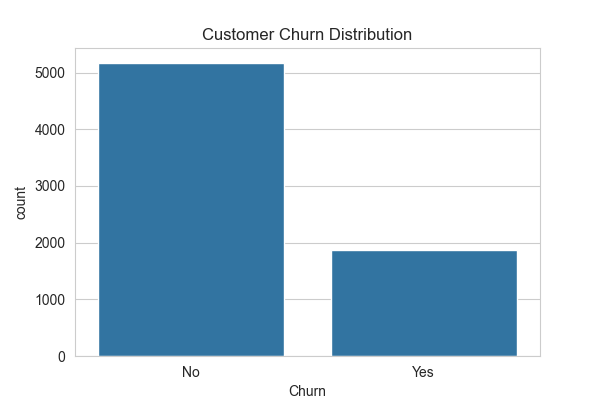
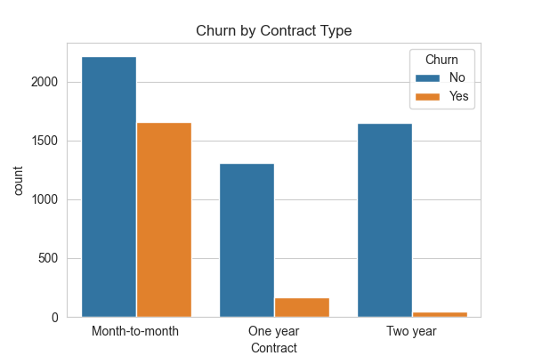
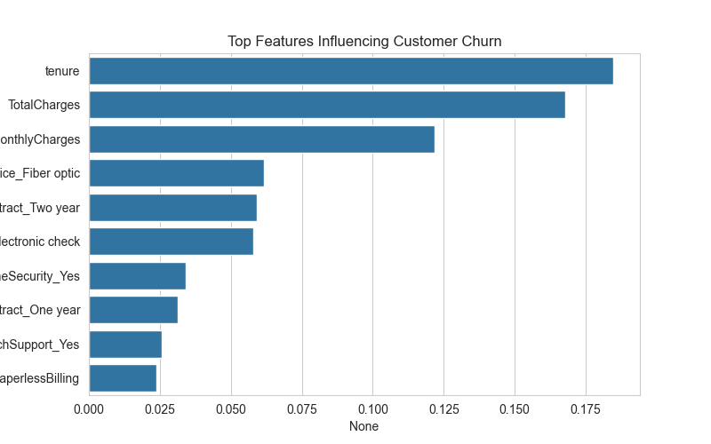
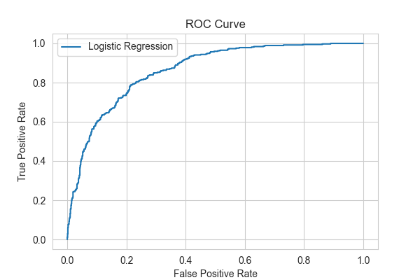

# Customer Churn Prediction

End-to-end machine learning project predicting telecom customer churn using Python, exploratory data analysis (EDA), feature engineering, and machine learning models.

---

## Project Overview

Customer churn prediction helps telecom companies identify customers who are likely to leave their service.

By predicting churn early, companies can take proactive actions such as:

* offering discounts
* improving customer support
* designing customer retention strategies

This project demonstrates a complete **data science workflow**, including:

* data preprocessing
* exploratory data analysis
* feature engineering
* machine learning modeling
* business insights

---

## Dataset

Dataset used: **IBM Telco Customer Churn Dataset**

The dataset contains information about telecom customers including:

* Demographics
* Services subscribed
* Account information
* Contract details
* Monthly charges
* Total charges
* Churn status

Total records:

**7043 customers**

Target variable:

```
Churn
```

* **1 → Customer churned**
* **0 → Customer stayed**

---

## Project Structure

```
customer-churn-prediction
│
├── data
│   ├── raw
│   └── processed
│
├── notebooks
│   └── churn_analysis.ipynb
│
├── src
│   ├── data_preprocessing.py
│   ├── train_model.py
│   └── evaluate_model.py
│
├── visuals
│   ├── churn_distribution.png
│   ├── churn_contract.png
│   ├── feature_importance.png
│   └── roc_curve.png
│
├── README.md
└── .gitignore
```

---

## Exploratory Data Analysis

Some key insights were obtained through exploratory data analysis.

### Customer Churn Distribution



### Churn by Contract Type



### Feature Importance



### ROC Curve



---

## Machine Learning Models Used

The following models were trained and evaluated:

* Logistic Regression
* Random Forest
* Gradient Boosting

Evaluation metrics used:

* Accuracy
* Precision
* Recall
* F1 Score
* ROC-AUC

---

## Model Performance

| Model               | Accuracy |
| ------------------- | -------- |
| Logistic Regression | 0.82     |
| Random Forest       | 0.81     |
| Gradient Boosting   | 0.81     |

Logistic Regression achieved slightly higher accuracy, suggesting that churn patterns in the dataset are captured effectively by a linear model.

---

## Key Business Insights

Analysis of the dataset reveals several important churn drivers:

* Customers with **month-to-month contracts** have the highest churn rate.
* Customers with **higher monthly charges** are more likely to churn.
* Customers with **shorter tenure** are more likely to leave the service.
* Customers without **technical support services** show higher churn probability.

These insights can help telecom companies implement targeted retention strategies.

---

## Technologies Used

* Python
* Pandas
* NumPy
* Matplotlib
* Seaborn
* Scikit-learn
* Jupyter Notebook

---

## Future Improvements

Possible improvements for this project include:

* Hyperparameter tuning using GridSearchCV
* Handling class imbalance using SMOTE
* Deploying the model using Streamlit
* Building an interactive churn prediction dashboard

---

## Author

Kevin Gandhi

Data Science Student


